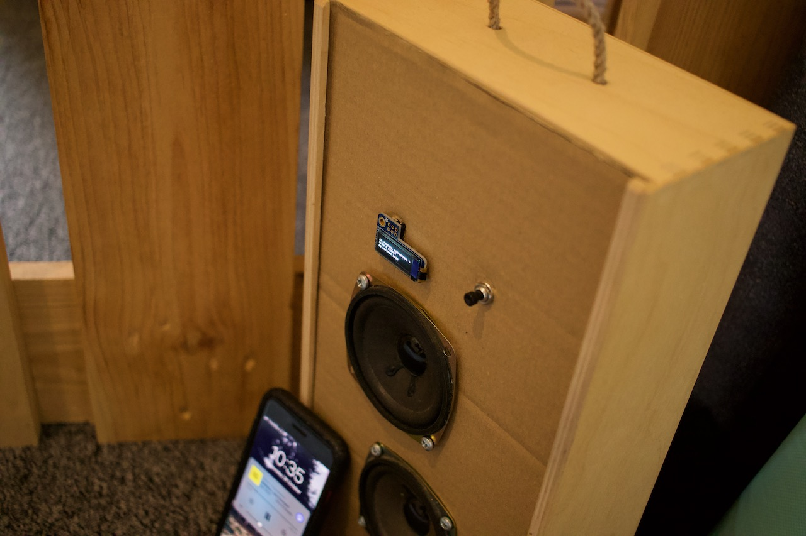

# Rasberry Pi powered Airplay boombox



### Parts

[Raspberry Pi Zero W](https://www.raspberrypi.org/products/raspberry-pi-zero-w/)

[SparkFun I2S Audio Breakout - MAX98357A](https://www.sparkfun.com/products/14809)

[Adafruit PiOLED - 128x32 Monochrome OLED Add-on for Raspberry Pi](https://www.adafruit.com/product/3527)


### Sound output

https://learn.adafruit.com/adafruit-max98357-i2s-class-d-mono-amp/raspberry-pi-usage


### Airplay support - Shairport

```
sudo apt-get install build-essential git xmltoman autoconf automake libtool libdaemon-dev libpopt-dev libconfig-dev libssl-dev libasound2-dev avahi-daemon libavahi-client-dev libsoxr-dev

git clone https://github.com/mikebrady/shairport-sync.git && cd shairport-sync && autoreconf -i -f && ./configure --sysconfdir=/etc --with-avahi --with-alsa --with-ssl=openssl --with-metadata --with-soxr --with-systemd && make && sudo make install && cd .. && rm -rf shairport-sync

sudo systemctl enable shairport-sync

git clone https://github.com/mikebrady/shairport-sync-metadata-reader.git && cd shairport-sync-metadata-reader && autoreconf -i -f && ./configure && make && sudo make install
```

### Display

https://learn.adafruit.com/adafruits-raspberry-pi-lesson-4-gpio-setup/configuring-i2c

```
sudo apt-get update && sudo apt-get install -y build-essential zlib1g-dev libjpeg8-dev autoconf autotools-dev automake python3-pip libopenjp2-7-dev libtiff5 python3-gpiozero

sudo pip3 install adafruit-circuitpython-ssd1306 pillow
```

https://learn.adafruit.com/adafruit-pioled-128x32-mini-oled-for-raspberry-pi/usage#running-stats-on-boot-3024325-15


```
sudo python3 /home/pi/winecase/display.py & > /home/pi/winecase/log.txt 2>&1
```


### Button

https://gpiozero.readthedocs.io/en/stable/recipes.html#pin-numbering

https://github.com/TonyLHansen/raspberry-pi-safe-off-switch